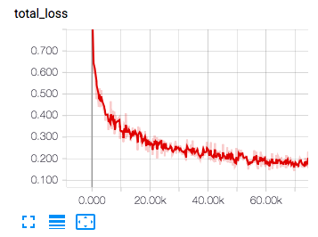
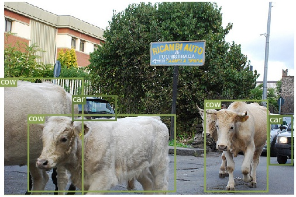
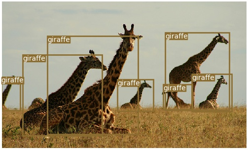

# YOLOv3
Full implementation of YOLOv3 in PyTorch.

## Overview
#### YOLOv3: An Incremental Improvement
[[Paper]](https://pjreddie.com/media/files/papers/YOLOv3.pdf)   
[[Original Implementation]](https://github.com/pjreddie/darknet)   

#### Why this project
* Implement YOLOv3 and darknet53 without original darknet cfg parser.   
* It is easy to custom your backbone network. Such as resnet, densenet...   

## Installation
##### Environment
* pytorch >= 0.4.0
* python >= 3.6.0
##### Get code
```
git clone https://github.com/BobLiu20/YOLOv3_PyTorch.git
cd YOLOv3_PyTorch
pip3 install -r requirements.txt --user
```
##### Download COCO dataset
```
cd data/
bash get_coco_dataset.sh
```

## Training
##### Download pretrained weights
1. See [weights readme](weights/README.md) for detail.   
2. Download pretrained backbone wegiths from [Google Drive](https://drive.google.com/open?id=1VYwHUznM3jLD7ftmOSCHnpkVpBJcFIOA) or [Baidu Drive](https://pan.baidu.com/s/1axXjz6ct9Rn9GtDTust6DA)   
3. Move downloaded file ```darknet53_weights_pytorch.pth``` to ```wegihts``` folder in this project.   
##### Modify training parameters
1. Review config file ```training/params.py```   
2. Replace ```YOUR_WORKING_DIR``` to your working directory. Use for save model and tmp file.
3. Adjust your GPU device. see parallels.   
4. Adjust other parameters.   
##### Start training
```
cd training
python training.py params.py
```
##### Option: Visualizing training
```
#  please install tensorboard in first
python -m tensorboard.main --logdir=YOUR_WORKING_DIR   
```
<p></p>


## Evaluate
##### Download pretrained weights
1. See [weights readme](weights/README.md) for detail.   
2. Download pretrained yolo3 full wegiths from [Google Drive](https://drive.google.com/file/d/1SnFAlSvsx37J7MDNs3WWLgeKY0iknikP/view?usp=sharing) or [Baidu Drive](https://pan.baidu.com/s/1YCcRLPWPNhsQfn5f8bs_0g)   
3. Move downloaded file ```official_yolov3_weights_pytorch.pth``` to ```wegihts``` folder in this project.   
##### Start evaluate
```
cd evaluate
python eval_coco.py params.py
```

## Quick test
##### pretrained weights
Please download pretrained weights ```official_yolov3_weights_pytorch.pth``` or use yourself checkpoint.   
##### Start test
```
cd test
python test_images.py params.py
```
You can got result images in output folder.   
<p align="center"></p>
<p align="center"></p>

## Measure FPS
##### pretrained weights
Please download pretrained weights ```official_yolov3_weights_pytorch.pth``` or use yourself checkpoint.   
##### Start test
```
cd test
python test_fps.py params.py
```
##### Results
* Test in TitanX GPU with different input size and batch size.   
* Keep in mind this is a full test in YOLOv3. Not only backbone but also yolo layer and NMS.   

| Imp.	| Backbone | Input Size | Batch Size | Inference Time | FPS |
| ----- |:--------:|:----------:|:----------:|:--------------:|:---:|
| Paper | Darknet53| 320        | 1          | 22ms           | 45  |
| Paper | Darknet53| 416        | 1          | 29ms           | 34  |
| Paper | Darknet53| 608        | 1          | 51ms           | 19  |
| Our   | Darknet53| 416        | 1          | 28ms           | 36  |
| Our   | Darknet53| 416        | 8          | 17ms           | 58  |

## Credit
```
@article{yolov3,
	title={YOLOv3: An Incremental Improvement},
	author={Redmon, Joseph and Farhadi, Ali},
	journal = {arXiv},
	year={2018}
}
```

## Reference
* [darknet](https://github.com/pjreddie/darknet)
* [PyTorch-YOLOv3](https://github.com/eriklindernoren/PyTorch-YOLOv3): Thanks for YOLO loss code
